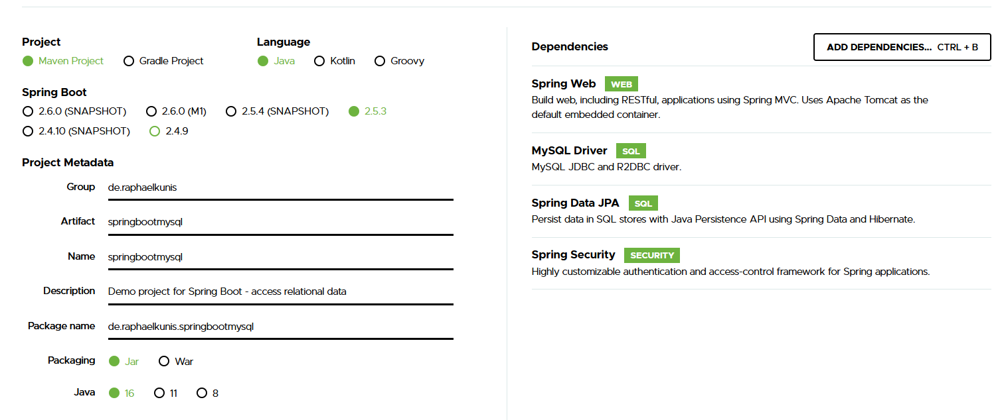
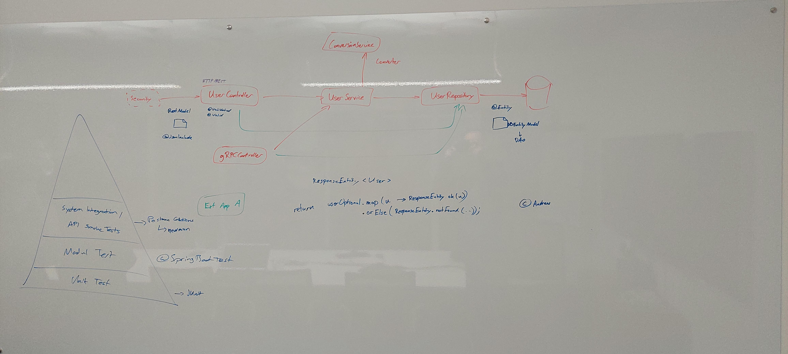

Starting with onboarding tutorial
09.08.2021

# Preparation

- installed Ubuntu
- installed Java 16 and set JAVA_HOME and PATH
- installed IntelliJ IDEA
- installed Docker Desktop
- installed Maven and set MAVEN_HOME AND PATH
- installed postman
- created git repository (https://github.com/RaphaelKunis/onboarding.git)
- installed mysql Workbench
- activate wsl (https://docs.microsoft.com/en-us/windows/wsl/install-win10)
	WSL 2 needed to use docker desktop in linux subsystem
- [x] all done
- Additional
	- install _Windows Terminal_ https://www.microsoft.com/de-de/p/windows-terminal/9n0dx20hk701?rtc=1#activetab=pivot:overviewtab
***
	
# Steps
## Step 1)
- new folder spring-boot-hello in git repository
- https://start.spring.io/
- [x] example is running 
- hints for curl
  - do not use curl in PowerShell as it works differently and the example from https://start.spring.io/ do not work   
***
  
## Step 2)
- `docker pull mysql`
- `docker run --name mysql_docker -e MYSQL_ROOT_PASSWORD=<PWD> -p 3306:3306 -d mysql`
- `docker ps`
- [x] docker mysql is running 
- Additional tip: to reuse container after reboot use `docker restart mysql_docker`
  - created tables and data are available
***
  
## Step 3) 
- mysql spring boot app with mysql connection
- new folder spring-boot-mysql in git repository (web + mysql + jpa + spring security)
  - hint: when spring security is chosen for spring Initializr then a login page is presented
    - use "user" as username and the password given in the cmd-line as login data in browser
    - for tests with curl uncomment the dependency in pom.xml at first as it has some difficulties to manage
      - curl with pwd: `curl -u user:pwd http://localhost:8080/demo/getUser`
      - curl with post: `curl -u user:pwd -X POST -F 'name=Name' -F 'email=e@mail.de' http://localhost:8080/demo/add`
- empty project from https://start.spring.io (https://spring.io/guides/gs/accessing-data-mysql/)
- 
- started docker container with mysql (see step 2)
  - added account with mysql workbench (springuser, ThePassword1234) and created database db_example;
    - see 
- added GetRequest for user by id `/demo/getUser`
- added Service class
  - [x] todo: implement addUser method in UserService
    - [ ] add better result -> JSON with HTTP error 400
- added input validation
  - [x] validation with bean annotation
    - information found on [https://www.baeldung.com/javax-validation](https://www.baeldung.com/spring-service-layer-validation) and [https://www.baeldung.com/spring-service-layer-validation](https://www.baeldung.com/spring-service-layer-validation)
- [x] todo add spring security 
  - uncomment `spring-boot-starter-security` in pom
  - test and try some things
    - now works in postman for all GET-methods
    - error in POST-method add -> 400 : "Forbidden"
      - maybe use [https://spring.io/guides/gs/securing-web/](https://spring.io/guides/gs/securing-web/)
      - added WebSecurityConfig-class
      - [x] hint from Andreas: CSRF-protection my be the problem -> google and test it
        - solution found on https://www.javainuse.com/spring/boot_security_csrf
        - add //http.csrf().disable(); to WebSecurityConfig -> for real world solutions not good.
  - additional resources for training
    - [https://labs.micromata.de/best-practices/tutorial-spring-security/einstieg-in-spring-security/](https://labs.micromata.de/best-practices/tutorial-spring-security/einstieg-in-spring-security/)
  
## presentation/discussion with Andreas and Sebastian
  - topic 1) Service Layer - need to move ALL services from Controller to Service Layer 
    
    - [x] todo
  - topic 2) packaging
    - how could the project be divided into packages
    - functional (mvc) or domain based (User)
    - [x] second one was chosen
      - UserService becomes Interface and UserServiceImpl was added   
    - [ ] implement better password behaviour
      - [x] move passwords to config file
      - [ ] hash passwords with bcrypt
      - [ ] use std password code snippet

      ```java
      PasswordEncoder encoder = PasswordEncoderFactories.createDelegatingPasswordEncoder();
        
      User.withUsername(user.getName())
          .password(password.startsWith("{bcrypt}") ? password : encoder.encode(password))
          .roles(user.getRoles().toArray(new String[0])).build();
      ```

## Step 4) openAPI-spec for endpoints
  - installed plugin for swagger (Zalando SE) 
  - added file openapi.yaml 
    - tutorial/definition on https://swagger.io/docs/specification/basic-structure/, http://editor.swagger.io
    - [x] tested it in editor on https://editor.swagger.io/
    - [x] import in Postman
      - Generate a collection resulted in error but the collection was there 
      - {{baseUrl}} in get-Requests -> set as variable 
      
## Step 5) Testing
  - software testing pyramid (see discussion)
    - [ ] write some unit tests
    - [ ] write a module tests -> @SpringBootTest
    - [ ] test with postman
  - guides/tutorials/hints
    - https://www.baeldung.com/spring-boot-testing
      - unit tests and spring boot tests
  - what i have done 
    - add spring-boot-starter to maven
    - add h2database to maven thus we do not need a real database (h2 = in memory db)

## Other things
  - [ ] enable spring boot framework support in IntelliJ
  - Problems with docker desktop update in November
    - stuck on startup in `Docker Engine starting...` 
    - solution
      ```
      Open "Window Security"
      Open "App & Browser control"
      Click "Exploit protection settings" at the bottom
      Switch to "Program settings" tab
      Locate "C:\WINDOWS\System32\vmcompute.exe" in the list and expand it
      Click "Edit"
      Scroll down to "Code flow guard (CFG)" and uncheck "Override system settings"
      ```

## Docker
  - https://spring.io/guides/gs/spring-boot-docker/